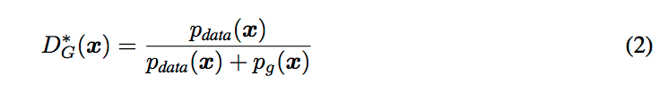

## Generative Adversarial Net

This paper is first time to introduce generative adversarial net.

First, author define GAN with equation below:

There are generator(*G*) and discriminator(*D*).

- Discriminator is used to judge whether the data is true( it means discriminator can tell the difference between examples `label 1` and fake data `label 0` generated by *G*)
- Generator is used to generate those fake data, which can cheat *D*. Another word, *D* should output 1(indicates it's an example) when processed fake data. 

It is an adversarial process. After that, after training procedure, *D* cannot judge the fake data generated by *G*.

In this paper, author proved that :

- global optimality is 

  + For *G* fixed, the optimal discriminator *D* is 

  + and when given training *D* to reach maximum, *iif*  

  + > So It means that after final train, disciminator outputs 1/2 when facing  fake data.

+ 

  

`have capacity` means that model has ability to learn data. 